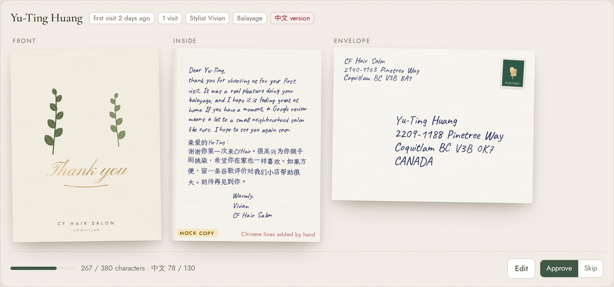

# CF Hair handwritten notes

Real pen-on-paper cards for CF Hair Salon clients, at scale: a thank-you after a first visit, a birthday card, a gentle "thinking of you" for lapsed clients, Lunar New Year and holiday greetings, and referral thank-yous. Claude writes every card individually from what the salon knows about the client; the owner reviews every card on a proof sheet; nothing is mailed without an approved list.

```
clients (booking API or CSV)
   -> plan       who qualifies, who is excluded and why, what it costs
   -> generate   Claude writes each note (Batches API for big runs), validated and retried
   -> proof      HTML proof sheet: card front, handwritten inside, addressed envelope; approve / skip / edit
   -> send       only the exported approved list; dry run unless --send; never twice
                 handwrytten (robot pens, mailed for you)  or  plotter (AxiDraw SVGs, you mail them)
```



## Run the demo

```bash
cd notes
npm install
npm run demo        # whole flow on sample/clients.csv; pretends today is Friday 2026-10-09
npm test            # vitest: audience rules, limits, retries, idempotency, Claude request shapes
```

Without `ANTHROPIC_API_KEY` the demo uses deterministic template copy, labelled "Mock copy" on the proof sheet, in the CSV (`writer=mock`) and in the run manifest, and the CLI refuses to mail mock copy through a real provider. With the key set, Claude writes every note. Open the proof sheets it prints (for example `out/win-back-2026-10-09/proof.html`) in a browser.

Behind a corporate HTTPS proxy, also set `NODE_USE_ENV_PROXY=1` so the proof can fetch its Chinese font subsets (it still works offline; it just links to Google Fonts instead of embedding).

## Commands

```bash
npm run notes -- campaigns
npm run notes -- plan     --campaign win-back --csv sample/clients.csv --staff sample/staff.sample.json --today 2026-10-09
npm run notes -- generate --campaign win-back --csv sample/clients.csv --staff sample/staff.sample.json --today 2026-10-09
npm run notes -- proof    --run win-back-2026-10-09
npm run notes -- send     --approved ~/Downloads/approved-win-back-2026-10-09.json            # dry run
npm run notes -- send     --approved ~/Downloads/approved-win-back-2026-10-09.json --send     # mail it
npm run notes -- send     --approved ... --send --test-mode      # Handwrytten test_mode: API round trip, nothing mailed
npm run notes -- send     --approved ... --send --provider plotter   # write AxiDraw SVGs instead
npm run notes -- catalog  # Handwrytten card and handwriting-font ids for your account
```

Data source: `--csv <file>` or, with no `--csv`, the live booking API (`BOOKING_API_URL` + `AGENT_API_KEY`, `GET /api/customers` and `GET /api/staff` per `docs/ARCHITECTURE.md`). `--today` defaults to today in America/Vancouver. See `.env.example` for every variable.

## How it works

**Audience** (`src/audience.ts`). Each campaign has a rule built from `firstVisitWithinDays`, `birthdayWithinDays`, `lastVisitBetweenDays`, `minVisits`, `maxVisits`, `hasTag`, `preferredLanguage`, `referredSomeoneWithinDays` and `everyone`, combined with `all` / `any` / `not`. A matching client is still skipped, with the reason shown in `plan`, if they have no complete Canadian address or a valid-format postal code, are tagged `do-not-mail` (or `no-mail`, `opt-out`, `moved`), already got this card for this occasion, or got any card in the last 30 days (`cooldownDays` in `settings.json`; birthday and referral cards ignore it).

**Writing** (`src/writer/`). One shared system prompt per run (salon voice, style and privacy rules, the campaign's guidelines, the character limit) is sent with `cache_control`, so every note after the first reads it from the prompt cache; only a short JSON client context changes per note (first name, stylist, last service, a fuzzy "about three months ago", a stylist note, the offer). Output is constrained to `{message, message_zh}` JSON. Runs of 25 or more notes go through the Message Batches API at half price; smaller runs use regular calls (first call alone to warm the cache, then 4 at a time) with server-side refusal fallback. Model `claude-opus-5-5` at `medium` effort (`settings.json`).

Every draft is then sanitised (smart quotes straightened, any em or en dash turned into a comma) and validated: within the character limit (the stricter of the campaign's and the provider's), no emoji, only characters a pen font can write, greets the client by name, never mentions their street, postal code, phone, email or birth year, no salesy phrases, includes the offer code if there is one, signature within Handwrytten's 50-character limit. A failing draft is sent back with the specific problems ("312 characters; the limit is 280, cut at least 57") up to 3 attempts; anything still failing is marked "needs attention" and cannot be approved until edited.

Clients whose preferred language is Chinese also get a Simplified Chinese version. Robot and plotter fonts are Latin-only, so the Chinese lines are shown on the proof as "added by hand" and listed in `hand-finish.txt` for the plotter.

**Proof** (`src/proof/`). A self-contained HTML page: the printed card front for the campaign's design, the inside in a ballpoint-style hand (Caveat with seeded per-letter tilt, baseline drift and ink-pressure variation on a paper texture), and the addressed envelope. Each card shows why the client was picked, a character meter and any problems, with Approve / Skip and Edit (live re-validation). "Export approved list" downloads `approved-<run>.json`: the only input `send` accepts. Fonts are embedded so the page works offline.

**Sending** (`src/run.ts`, `src/providers/`). `send` re-validates every approved card, refuses anything whose idempotency key does not match the run, and is a dry run unless `--send` is given. Each card's idempotency key is `campaign:client:occasion` (for example `win-back:c012:lv-2026-07-20`, `birthday:c007:2026`), recorded in `data/history.json` (gitignored) as `submitting` before the provider call and `sent` after it. A key that is `sent` is never mailed again; one left in `submitting` by a crash blocks a resend until someone checks the provider dashboard; a `failed` call can be retried. A lock file stops two sends running at once.

- `handwrytten`: one basket per card (`POST orders/placeBasket` then `POST basket/send`), API key in the `Authorization` header, the idempotency key as `client_metadata` and an `Idempotency-Key` header. Before the first card it checks the basket is empty so a stale item cannot ride along. Built against Handwrytten's official TypeScript SDK (v1.7.0) request shapes.
- `plotter`: two millimetre-accurate single-stroke SVGs per card (A2 card inside 108 x 140 mm in EMS Felix, A2 envelope 146 x 111 mm in EMS Readability Italic) with seeded wobble so no two cards look machine-identical. Plot with `axicli <file>.svg` or Inkscape, add a Canada Post stamp, mail.

## Cost per card

| Provider | Per card (to a Coquitlam address) | Notes |
|---|---|---|
| Handwrytten pay-as-you-go | USD 3.75 card + 1.80 international stamp + 0.10 surcharge = USD 5.65, **about CAD 7.74** | Real pen, mailed from the US. Platinum subscription (20% off cards) about CAD 6.71 |
| AxiDraw in-house | CAD 0.85 card and envelope + 1.24 stamp + 0.05 ink = CAD 2.14, **about CAD 3.47** with 4 minutes of front-desk time | Canadian stamp, local postmark; plotter about CAD 900 to 1,200 one-time |
| Claude writing | about CAD 0.03 per note (CAD 0.015 in batches) | Opus 5.5 with the shared prompt cached |

Prices and the exchange rate live in `settings.json`; `plan` prints the total for each run. Sources and the provider comparison: `docs/research/handwritten-notes-providers.md`.

## Why it pays (ROI framing)

Assumptions to replace with the salon's real numbers: an average ticket of about CAD 60 (between a CAD 50 women's cut and colour services at CAD 85 to 230), and a regular who comes every 6 to 8 weeks, so about CAD 400 to 500 a year.

- **Win-back.** Seven lapsed clients cost about CAD 54 in cards. If one of them comes back for a single visit, the run is paid for. If that client stays for a year, it returns roughly 8 times its cost. Break-even is one returning client in about every 8 cards for a single visit, or one in about 60 if they become a regular again.
- **First-visit thank-you.** The cheapest moment to win a regular. A second visit is the hard one; a handwritten card from the stylist who did the cut is something chains do not do. It is also the most natural place to ask for a Google review, which a salon with almost no online reviews needs most.
- **Birthdays and Lunar New Year** keep the salon in mind between visits for clients who already like it; for many Henderson Place clients a Lunar New Year card in their own language will be remembered.

Track it simply: the offer codes (`WELCOME15`, `BDAYTREAT`) tell you which bookings came from which card.

## Add a campaign

Create `campaigns/<id>.json` (copy `win-back.json`):

```json
{
  "id": "post-colour-check-in",
  "name": "How is the colour?",
  "description": "Two weeks after a colour service.",
  "occasion": "check-in after a colour service",
  "audience": { "all": [ { "rule": "lastVisitBetweenDays", "min": 12, "max": 18 }, { "rule": "hasTag", "tag": "colour" } ] },
  "design": "cf-gratitude",
  "guidelines": "Ask how the colour is settling in and share one care tip. No offer.",
  "maxChars": 340,
  "maxCharsZh": 120,
  "signature": { "template": "Warmly,\n{stylistFirstName}\nCF Hair Salon", "fallback": "Warmly,\nThe CF Hair team" },
  "offer": null,
  "dedupe": "lastVisit",
  "chinese": true,
  "handwrytten": { "cardId": null, "font": null }
}
```

`dedupe` decides what "the same card" means: `once` (ever), `year`, `lastVisit` (once per lapse), `firstVisit`, or `referral` (once per referred friend). Designs: `cf-thank-you`, `cf-birthday`, `cf-thinking-of-you`, `cf-gratitude`, `cf-referral`, `cf-lunar-new-year`, `cf-holiday` (`src/proof/designs.ts`); for Handwrytten, upload the matching front as a custom card and put its id in `handwrytten.cardId`. Run `npm run notes -- plan --campaign <id>` to check the audience before generating.

## Sample data

`sample/clients.csv`: 25 fictional clients across Coquitlam and Port Moody (valid-format postal codes, invented addresses and contact details) anchored to 2026-10-09, covering every campaign plus the edge cases: just outside the win-back window on both sides, a missing address, a do-not-mail tag, a Feb 29 birthday, Chinese-preference clients and two referrals. `sample/staff.sample.json` gives the placeholder stylists sample first names (Vivian, Jason, Anna); `shared/salon.json` still has "Stylist A/B/C", which are never printed on a card (the signature falls back to "The CF Hair team").

## Known gaps

- The live Claude path is covered by tests against a stubbed SDK client but has not been run against the real API from this environment (no API key here). Run `generate` once with a key and read the proof before the first real send.
- Handwrytten prices come from search extracts and third-party listings because the vendor site was not reachable from the build sandbox; confirm Canadian postage and the card id/font on the account (`catalog`, then `send --send --test-mode`).
- `/api/customers` has no last-service, language, referral or stylist-notes fields yet. The notes pipeline uses them when present (`lastServiceId`, `preferredLanguage` or a `lang:zh` tag, `referredBy`, `notes`) and writes a slightly less specific card without them.
- Win-back does not yet know about upcoming bookings; a client who already rebooked could still get a card. Add an `upcoming` flag to the API or tag them.
- Chinese text is never robot-written; it needs a person or a printed insert.
